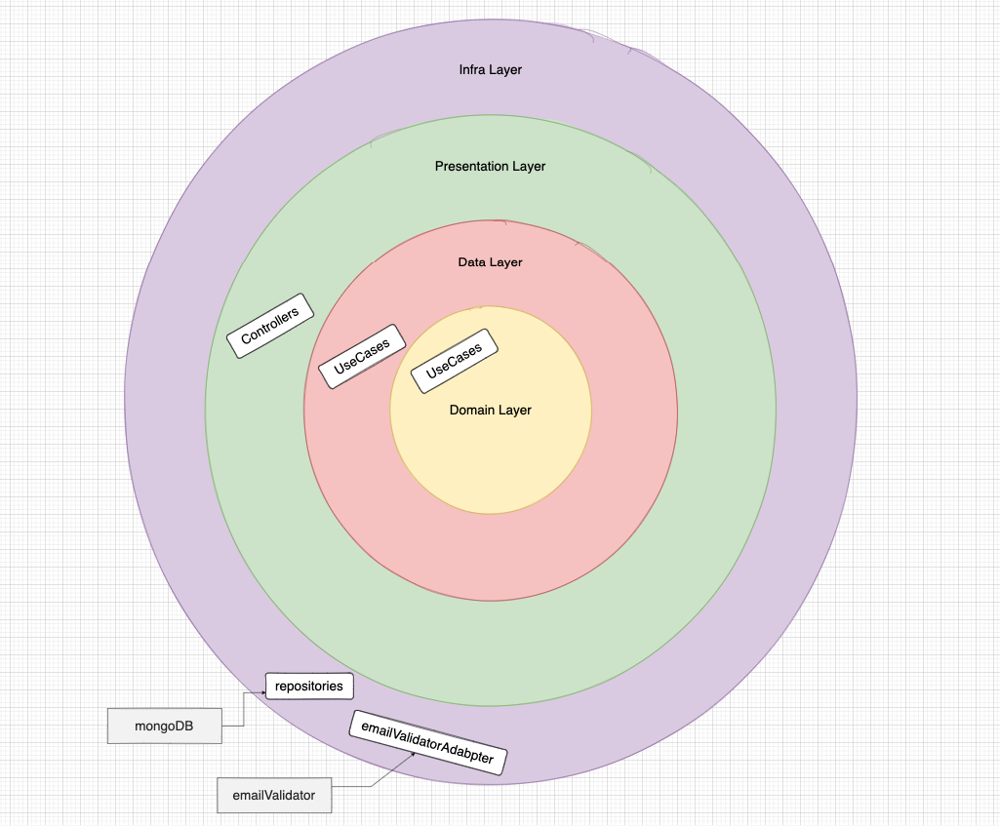

# Arquitetura da Clean-API

## Sumário

- [Arquitetura da Clean-API]()
  - [Sumário](#sumário)
  - [Motivo](#motivo)
  - [Organização](#organização)
    - [Docs](#docs)
    - [Src](#src)
      - [- Data](#data)
      - [- Domain](#domain)
      - [- Infra](#infra)
      - [- Main](#main)
      - [- Presentation](#presentation)
      - [- Validation](#validation) WIP
  - [Grau de dependência](#grau-de-dependência)
  - [Arquitetura de testes](#arquitetura-de-testes)

## Motivo 

Com o início do desenvolvimento de novos serviços, é de extrema importância que um padrão de desenvolvimento e organização seja definido com o intuito de garantir que os desafios enfrentados pelos times sejam nas implementações do negócio e não na reescrita de padrões. Sendo assim, neste documento serão abordados propostas que garantam um bom desenvolvimento de projetos atuais e futuros.

## Introdução

A arquitetura do projeto se <strong>inspira</strong> no livro `Clean architecture`. Com isso, temos organização de projeto por <strong>camadas</strong> em que, de modo breve possuem as seguintes responsábilidades: 
- `main` será responsável pela composição das camadas
- `domain` no centro da aplicação é responsável por definir as entidades e regras de negócio
- `data` responsável por implementar as regras de negócio
- `infra` responsável por implementar todas as classes responsáveis com a comunicação externa a nossa aplicação exemplo, banco de dados e libs externas.
- `presentation` responsável pela exposição das regras de negócio aos usuários
- `validation` responsável pela implementação das regras de validação para ser utilizada por outros serviços.


## Organização

Modelo inicial de organização do projeto:

```
project
...
├── src
│   ├─── data
│   ├─── domain   
│   ├─── infra
│   ├─── main
│   ├─── presentation
│   ├─── validation
...
```

Abaixo serão descritas as características e definições de cada nível apresentado anteriormente

### Src

Utilizada como centralizador colunar do projeto, contendo todo o código produtivo e não produtivo da aplicação.

Abaixo, a organização sugerida para a pasta `/src` será apresentada: 

#### Data

> Tambem conhecido como Services

Pasta `Data` é responsável por implementar todos os casos de uso da nossa camada `Domain` e definir todos os `protocols` que ele é dependente.

A pasta `protocols` dentro da pasta `Data` defini todas as interfaces necessárias para implementar as regras de negócio explícitadas na `Domain`

A camada `Data` protege o nosso `Domain` sendo ela a única camada que implementa os casos de uso da `Domain`.

#### Domain

Pasta utilizada para armazenar casos de uso e as entidades. Aqui casos de uso são apenas interfaces que definem nossas regras de negócio da aplicação em que camada data será responsável por usas implementações.

A camada `Domain` é <strong>independente</strong> da aplicação, ou seja, ela não possui imports para camada externa alguma, apenas tendo imports por arquivos internos dela mesma.
```
project
...
├── src
│   ├─── domain
│      ├─── models
│      ├─── usecases
...
```


#### Infra

A `Infra` visa implementar recursos externos (dependências de terceiros e ou globais) através de interfaces definidas por outras camadas do projeto.

Exemplo de implementações banco de dados, pacotes de ORM, pacotes de serviços de entre outros podem ser implementados nesta pasta.

- ##### Repositories
  Tem como responsabilidade garantir as implementações e manipulações da camada de dados.

#### Main

A camada `Main` é responsável pela composição do projeto desde as Classes e também por o próprio servidor. Tendo implementações do framework `express` e suas rotas.
- ##### Factories
    Camada responsável pela composição das classes.


#### Presentation

A `Presnetation` é responsável pela orquestração entre serviços e também faz a preparação dos dados que serão "apresentados" ao usuário.

Também responsável por termos a implementação da comunicação ao mundo externo do projeto tendo os padrões de comunicação HTTP, GRAPQHQL e entre outros.

rsos da aplicação, além de possuir seus respectivos métodos apresentados na camada `/interfaces`.


## Layers [WIP]

<p align="center">
 
</p>

## Arquitetura de testes

Aplicação de testes devem seguir a seguinte organização:

**Mocks**
- Todos os mocks de todos os testes devem implementar por default sempre o caminho feliz do método que você deseja testar. Para que assim, os teste que testarem algum tipo de exceção do cenário necessáriamente terão que escrever um mock e assim deixamos explícito ao leitor o cenário do teste. E consequentemente o cenário feliz do método testado não terá nenhum mock explícito apenas exeução do método e seu assert.
- Montamos os mocks via factories.

**Unitários**

Todo teste unitário terá terminação do arquivo como `meu-codigo.spec.ts`

Todo teste unitário deve estar na mesma pasta do arquivo testado por Exemplo:

```
project
...
├── data
│   └── calculadora
│   	 ├─── calcula-raiz-quadrada.ts
│   	 └─── calcula-raiz-quadrada.spec.ts
...
```
**Integração** [WIP]

Todo testes de integrácão terá terminação do arquivo como `meu-codigo.test.ts`

